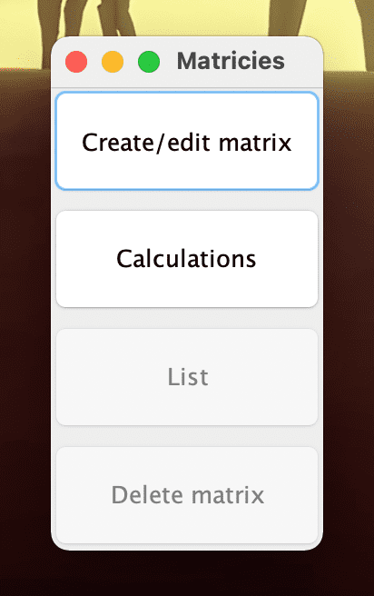
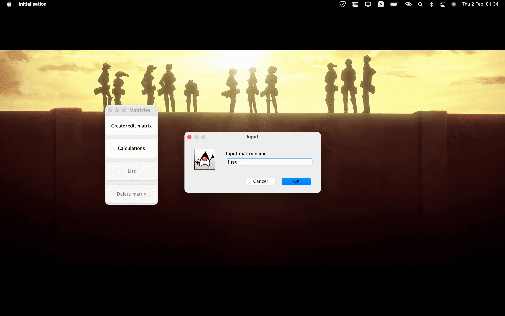

# Калькулятор матриц комплексных чисел

#### Стартовое меню дает возможность выбрать 4 действия

-> *Создание/изменение матрицы*  
-> *Произвести операции с матрицами*  
-> *Вывести список существующих матриц*  
-> *Удаление матриц*  

#### Каждая матрица имеет свое название 

#### Значения матрицы задаются, как показано на примере

#### Вишенка на торте и основное назначение - *вычисления*

Позволяет выбрать операции и операнды из выпадающих списков, кроме того, позволяет сохранить результат в уже существующую матрицу (можно создать соответствующей кнопкой) или только вывести, без сохранения (значение - None)

 

Так же есть возможность вычислить *детерминант*

#### Вывод всех созданных матриц

#### Удаление матриц

